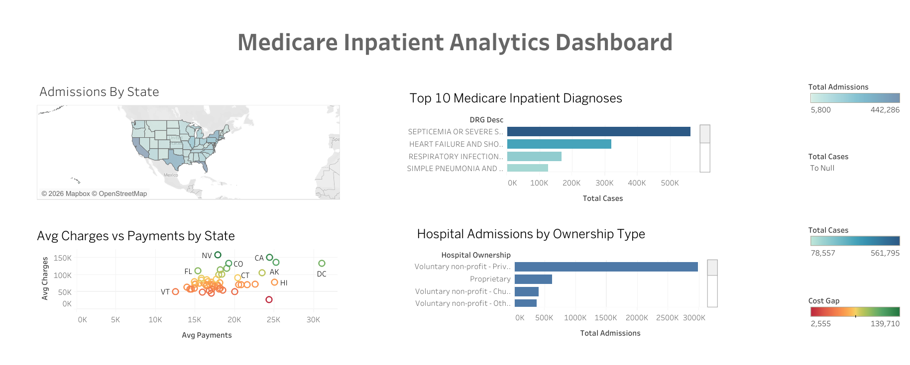

# 🏥 Medicare Inpatient Analytics Dashboard

A healthcare analytics project analyzing Medicare inpatient data across 
3,000+ U.S. hospitals using CMS public data, SQL, and Tableau Public.

---

## 📊 Live Dashboard
👉 [View Interactive Dashboard on Tableau Public](https://public.tableau.com/views/MedicareInpatientAnalyticsDashboard/Dashboard1?:language=en-US&:sid=&:redirect=auth&:display_count=n&:origin=viz_share_link)



---

## 📌 Project Overview
This project analyzes Medicare Inpatient Hospital data from the Centers 
for Medicare & Medicaid Services (CMS) to uncover patterns in hospital 
admissions, diagnosis trends, cost gaps, and ownership performance 
across the United States.

---

## 🔍 Key Business Questions Answered
1. Which states have the highest Medicare inpatient admission volumes?
2. What are the top 10 most common diagnoses nationally?
3. How large is the gap between what hospitals charge vs. what Medicare pays?
4. Which hospital ownership types handle the most Medicare patients?

---

## 💡 Key Insights
- **Septicemia** is the #1 Medicare inpatient diagnosis nationally 
  with 450K+ cases — highlighting the growing burden of infection-related 
  hospitalizations
- **Nevada and California** have the highest average charges but 
  disproportionately lower Medicare payments — indicating the largest 
  cost gaps
- **Maryland** is a significant outlier — low average charges but 
  relatively high payments, likely due to its unique all-payer hospital 
  rate setting system
- **Voluntary non-profit hospitals** handle the majority of Medicare 
  inpatient volume — far exceeding government and for-profit facilities

---

## 🛠️ Tools & Technologies
| Tool | Purpose |
|---|---|
| SQL (SQLite) | Data extraction, transformation, aggregation |
| DB Browser for SQLite | Local SQL environment |
| Tableau Public | Interactive dashboard & visualization |
| CMS Medicare Data | Primary data source |

---

## 📂 Repository Structure
```
healthcare-patient-flow-dashboard/
│
├── README.md
├── Dashboard.png
│
├── sql/
│   ├── 01_admissions_by_state.sql
│   ├── 02_top_10_diagnoses.sql
│   ├── 03_avg_charges_vs_payments.sql
│   ├── 04_cost_gap_by_state.sql
│   ├── 05_hospital_ownership_analysis.sql
│   └── 06_cost_efficiency_ranking.sql
│
└── data/
    └── data_source_info.md
```

---

## 📋 SQL Highlights

**Total Admissions by State**
```sql
SELECT 
    Rndrng_Prvdr_State_Abrvtn AS state,
    SUM(Tot_Dschrgs) AS total_admissions
FROM inpatient_data
GROUP BY Rndrng_Prvdr_State_Abrvtn
ORDER BY total_admissions DESC;
```

**Top 10 Diagnoses Nationally**
```sql
SELECT 
    DRG_Desc,
    SUM(Tot_Dschrgs) AS total_cases
FROM inpatient_data
GROUP BY DRG_Desc
ORDER BY total_cases DESC
LIMIT 10;
```

**Cost Gap Analysis by State**
```sql
SELECT
    Rndrng_Prvdr_State_Abrvtn AS provider_state,
    ROUND(AVG(Avg_Submtd_Cvrd_Chrg), 2) AS avg_charges,
    ROUND(AVG(Avg_Tot_Pymt_Amt), 2) AS avg_payments,
    ROUND(AVG(Avg_Submtd_Cvrd_Chrg) - 
          AVG(Avg_Tot_Pymt_Amt), 2) AS cost_gap
FROM inpatient_data
GROUP BY Rndrng_Prvdr_State_Abrvtn
ORDER BY cost_gap DESC;
```

---

## 🗄️ Data Source
- **Dataset:** Medicare Inpatient Hospitals by Provider and Service
- **Source:** [CMS Provider Data Catalog](https://data.cms.gov/provider-data)
- **Hospital Info:** [Hospital General Information](https://data.cms.gov/provider-data/dataset/xubh-q36u)
- **Coverage:** 3,000+ U.S. hospitals, Medicare Part A beneficiaries
- **License:** Public domain — U.S. Government open data

---

## 👩‍💻 Author
**Likhitha Neerati**  
Data Analyst | MS Data Science, UMKC  
📧 likhithaneerati@gmail.com  
🔗 [LinkedIn](https://www.linkedin.com/in/likhitha-neerati-50609a1a6)  
📊 [Tableau Public Profile](YOUR_TABLEAU_PROFILE_URL)
